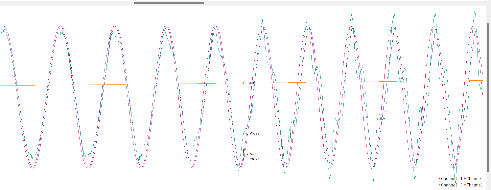
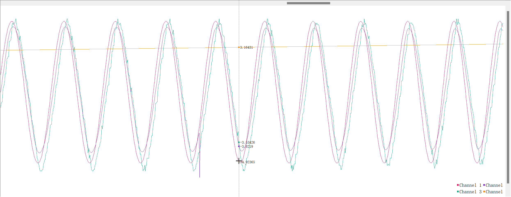

## VSAFreqTest

### 一、简介

#### 功能描述

对两款变刚度驱动器进行频率响应测试，500 Hz 的控制周期，使用驱动器所用电机自带的位置环控制模式，并结合 AS5048 编码器获取关节角度。最后利用串口绘图工具绘制出参考轨迹、电机轨迹（减速后）、关节轨迹、频率

#### 器件说明

主控板：[科鑫 F407ZGT6 小精灵工控板](https://item.taobao.com/item.htm?abbucket=15&id=670916126616&ns=1&spm=a21n57.1.0.0.38ac523cJT4tsF)

编码器：[AS5048A](https://item.taobao.com/item.htm?abbucket=15&id=619004953504&ns=1&skuId=4545021555900&spm=a21n57.1.0.0.52d9523cIHfgau)（绝对位置编码器）

MACCEPA 关节电机：[上海瓴控科技有限公司](http://www.lkmotor.cn/)，MG8016E-i6, V3 直流无刷电机（集成驱动器），支持 UART, 485, CAN 通信。本项目使用 CAN 通信进行位置环控制

HFVSA 关节电机及驱动器：略。支持 UART 和 485 通信。本项目使用 UART 通信进行位置环控制

### 二、程序设计

使用 STM32CubeMX + Keil5 + VSCode 开发

---

#### 1、CubeMX 配置

- 配置外部晶振，主频 HCLK 设置为 160MHz，则 APB1 主频自动计算为 80MHz

- 配置 USB 转串口：USART1 波特率设置 2000000 Bit/s，引脚设置为 PA9, PA10

- 配置 TIM2

  - 预分频 80-1，计数周期设置最大（计数时间能大于 PWM 周期就行）
  - 使能全局中断，配置通道 1 为输入捕获模式，对应引脚为 PA15。

- 配置 TIM4

  - 设置时钟源为内部时钟
  - 预分频 8000-1，计数周期 20-1（计数时间可算得：$[(20-1)+1] \times \frac{1}{\frac{80\times10^6}{[(8000-1)+1]}} = 0.002s = 2ms$，也就是 500Hz 的控制频率）

  - 使能全局中断

- 配置 CAN1 通信（MACCEPA 关节电机要用）
  - 预分频 4，位段 1 时间量子为 5，位段 2 时间量子为 4。则可算得波特率为 1M bit/s
  - 对应引脚为 PD0 和 PD1
  - 使能 RX0 和 RX1 中断
- 配置 UART 通信（HFVSA 关节电机要用）
  - 波特率设置 921600 Bit/s，引脚设置为 PB10, PB11
  - 使能全局中断


- 配置项目输出：项目名、Toolchain（选择 MDK-ARM）、勾选 `Generate peripheral initialization as a pair of'.c/.h'files per peripheral`

#### 2、Keil 配置

- Options——Target 中，勾选 Use MicroLIB（否则 printf 进行串口打印不显示）
- Options——C/C++ 中，勾选 C99 Mode；修改优化级别为 Level 0；Include Paths 添加自己编写代码的 User 文件夹；Misc Controls 填写 `--cpp11`
- Options——Debug 中，选择 ST-Link Debugger，点击后面的 Setting 按钮，选择 SW 接口，并确认 ST-Link 连接正常。Flash Download 中确认勾选 Reset and Run，并确认 `Programming Algorithm` 为 `STM32F4xx 1MB Flash`

#### 3、程序介绍

##### my_spdlog 头文件和源文件

- stm32 实现串口日志打印的文件，可进行五种级别的日志输出。

- 思路是受一位电赛选手的[个人博客](https://github.com/CNYuYang/My-19-years-old)启发（博主说他也是阅读国内某云物联网模块源码时发现并学习的）。自己根据 C++ 日志库 spdlog 的样式习惯重新进行了设计编写

- 使用方法：只需要包含头文件即可使用

  ```c
  #include "my_spdlog.h"
  ```

##### my_can 头文件和源文件

- stm32 进行 CAN 通信的文件，主要包含 CAN 总线初始化函数、CAN 数据帧发送函数、CAN 滤波器配置函数、CAN 接收 FIFO1 中断函数

- 主要都是参考：[【中科大RM电控合集】小白也能看懂的CAN通信+STM32CubeMX编程](https://www.bilibili.com/video/BV1HY411D7Ar) 提供的代码，自己基本没做修改

- 使用方法

  - 包含头文件

    ```c
    #include "my_motor.h"
    ```

  - 进行初始化配置

    ```c
    CAN_Init(&hcan1);  // 初始化CAN总线
    CAN_Filter_Mask_Config(&hcan1, CAN_FILTER(13) | CAN_FIFO_1 | CAN_STDID | CAN_DATA_TYPE, 0x141, 0x000);
    ```

##### my_motor 头文件和源文件

​		编写了 MACCEPA 电机控制相关接口函数（读取多圈角度；多圈位置闭环控制）、方波和正弦波运动测试函数（正弦波为定时器 500Hz 控制，方波为 HAL_Delay 函数实现的简单控制）、浮点数串口绘图函数

##### my_motor_bd 头文件和源文件

​		编写了 HFVSA 电机控制相关接口函数（打开电机使能；禁用电机使能；位置控制）、正弦波运动测试函数（定时器 500Hz 控制）、浮点数串口绘图函数

##### main.c 文件

全局变量

```c
volatile uint8_t timer4_flag = 0;  // 定时器 4 是否进入中断的标志位

float AS5048_angle;  // 记录 AS5048 编码器角度
float AS5048_angle_zero = 0;  // 记录 AS5048 编码器初始角度，之后可能用到
```

定时器初始化部分

```c
HAL_TIM_Base_Start_IT(&htim4);   // 使能定时器 4 中断，用于位置控制

HAL_TIM_IC_Start_IT(&htim2, TIM_CHANNEL_1);  // 使能定时器 2 的通道 1 输入捕获通道中断，用于捕获 PWM 信号，计算频率和占空比
```

while 循环里面可以使用运动测试函数等

定时器 4 中断回调函数

```c
void HAL_TIM_PeriodElapsedCallback(TIM_HandleTypeDef *htim)
{
	if(htim==&htim4)
	{
		timer4_flag = 1;
//		user_spdlog_debug("enter timer4");
	}
}
```

定时器 2 输入捕获回调函数

```c
void HAL_TIM_IC_CaptureCallback(TIM_HandleTypeDef *htim) {
    if (htim == &htim2) {
        略，主要是计算捕获到的 PWM 信号占空比，并利用占空比计算角度值
        其中给 AS5048 归零部分代码可以再优化一下，自己随便写的
    }
}
```

### 三、测试效果

SerialPlot工具，红色为正弦波参考轨迹；紫色为电机轨迹；绿色为关节轨迹；橙色为正弦波频率值

---

##### MACCEPA频率响应测试

正弦波幅值为 10，频率从 0.5 逐渐升高



##### HFVSA频率响应测试

正弦波幅值为 5，频率从 0.5 逐渐升高

